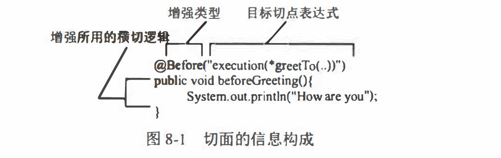
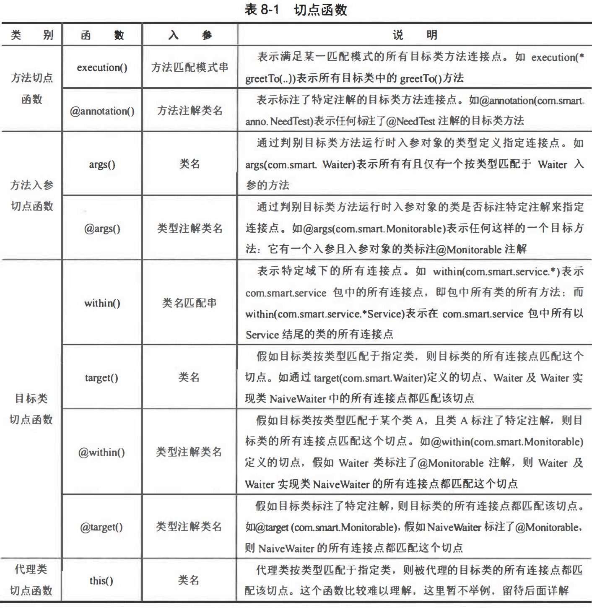
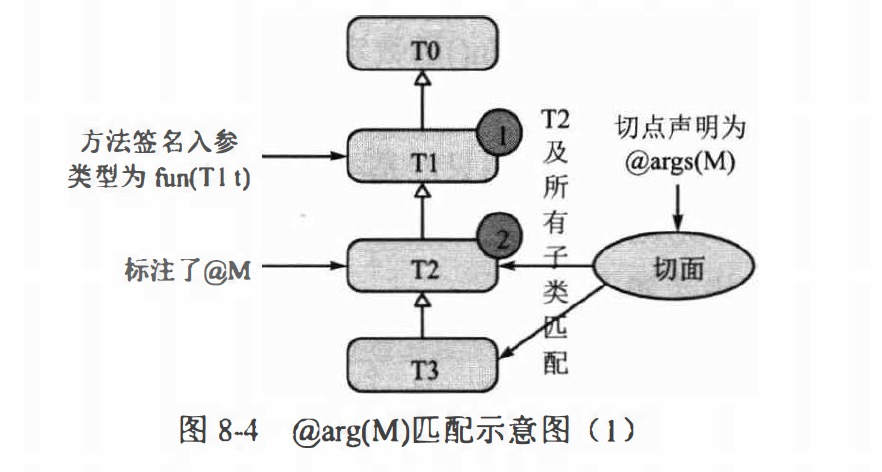
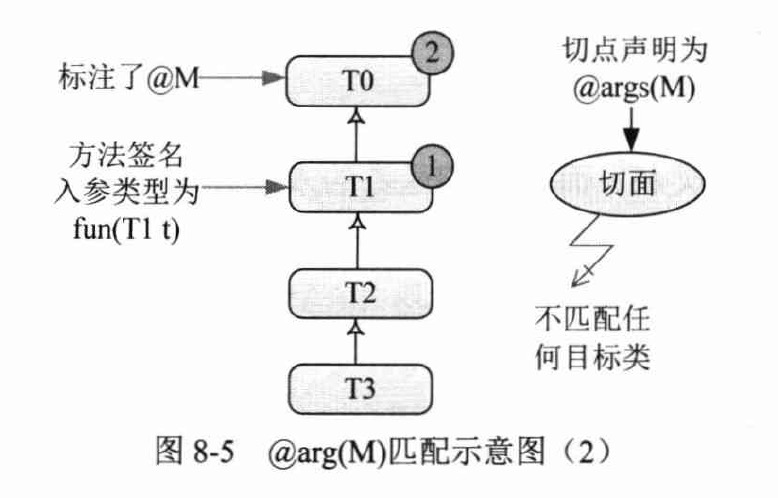
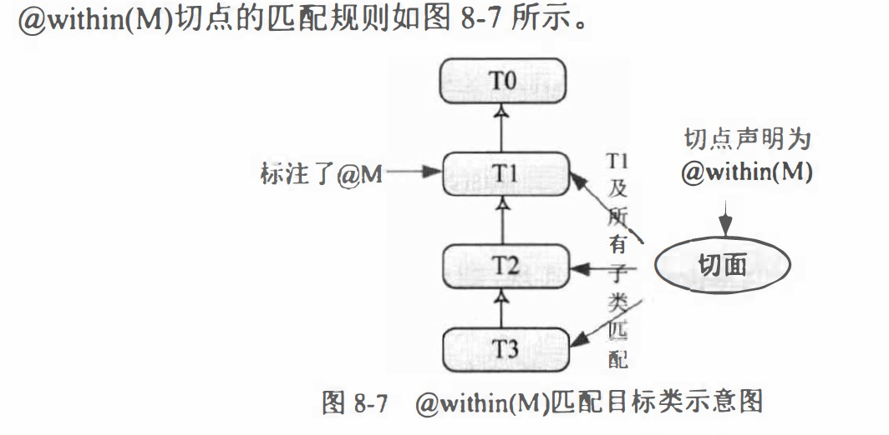
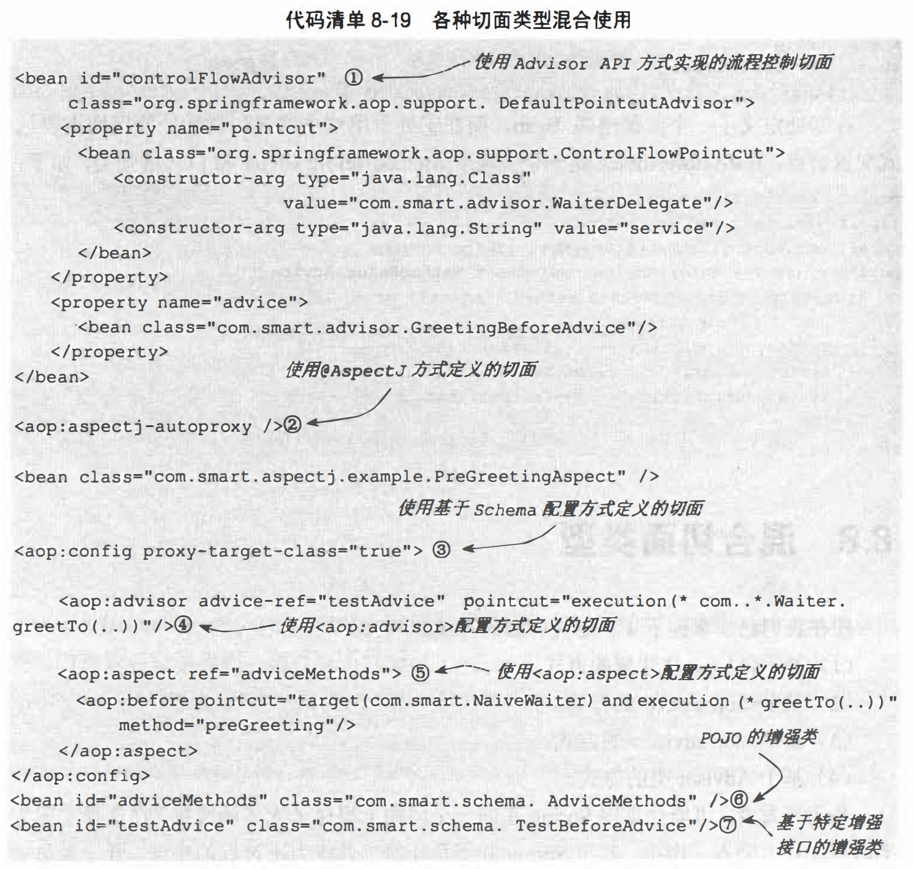

#Spring事务（基本了解和使用）

    事务特性：
      原子性:事务里面的操作单元不可切割,要么全部成功,要么全部失败 
      一致性:事务执行前后,业务状态和其他业务状态保持一致. 
      隔离性:一个事务执行的时候最好不要受到其他事务的影响 
      持久性:一旦事务提交或者回滚.这个状态都要持久化到数据库中 
    
    不考虑隔离性会出现的读问题 :
      脏读: 在一个事务中读取到另一个事务没有提交的数据 
      不可重复读: 在一个事务中,两次查询的结果不一致(针对的update操作) 
      虚读(幻读): 在一个事务中,两次查询的结果不一致(针对的insert操作) 
      第一类丢失更新：A事务撤销时，覆盖B事务提交的数据
      第二类丢失更新：A事务提交时，覆盖B事务提交的数据
    
    
    通过设置数据库的隔离级别来避免上面的问题(理解) 
      read uncommitted    读未提交    上面的三个问题都会出现 
      read committed      读已提交    可以避免脏读的发生 
      repeatable read     可重复读    可以避免脏读和不可重复读的发生 
      serializable        串行化      可以避免所有的问题
    
    注意：事务的隔离级别和数据库并发性是成反比的，隔离级别越高，并发性越低。
    
##数据库锁机制

    从锁定的对象同，一般分为表锁定和行锁定。
    表锁定：是指对整张表进行锁定
    行锁定：指对表中的某一行进行锁定
    
    从并发事务的关系上看，分为共享锁定和独占锁定
    共享锁定：会防止独占锁定，但允许其他共享锁定
    独占锁定：会防止其他独占锁定和共享锁定
    为了更改数据，数据库必须在进行更改的行上施加行独占锁定，INSERT 、 UPDATE、 DELETE 和 SELECT FOR UPDATE 语句都会隐式采用必要的行锁定。
      
##ThreadLocal基础知识

    简单说：在多线程环境中，为每个线程制作一个本地化数据的副本
    
    ThreadLocal接口方法说明：
    void set():给当前线程局部赋值
    Object get():获取当前线程局部的值
    void remove()：删除当前局部变量的值，垃圾回收，释放内存
    Object initialValue()：返回该线程局部变量初始值
    
    ThreadLocal 和线程同步机制都是为了解决多线程中相同变量的访问冲突问题。那么ThreadLocal和线程同步机制相比有什么优势呢?
    线程同步机制：以时间换空间，只有一个线程访问变量，采用对象锁的机制，对数据的处理上浪费时间，且占用线程对象，需要进行数据同步
    ThreadLocal：以空间换时间，会制作对象副本，不会影响对线程环境对对象的访问，防止冲突。

**请看threadlocal包中简单实例**

##Spring事物管理

**配置文件中的事物管理配置**

关于事物深入了解请查看《精通Spring+4.x++企业应用开发实战》

#SpringAOP（基本了解和使用）

    首先引入所有的包：cglib，aop 等
    第一步：启用 aop 配置文件 <aop:aspectj-autoproxy/>
    第二步：编写增强 com.lm.springaop.aop.advice 五种增强类型
    第三步：测试 aop 在 service Test 中两种简单实现方式；或：在配置文件中，通配符扫描相应的类或接口
    
切点类型： 

    静态方法切点，动态方法切点，注解切点，流程切点，复合切点， 表达式切点
    
切面类型：  

    一般切面：Advisor
    切点切面：PointcutAdvisor 包含六个具体的实现类
    引介切面：IntroductionAdvisor  
    
##SpringAOP自助创建代理
    
    "Spring 使用 BeanPostProcessor 自动完成这项工作 。"
    代理创建器分为三类：
    
    1：基于 Bean 配置名规则的自动代理创建器：允许为一组特定配置名的Bean自动创建代理实例的代理创建器，实现类为 BeanNameAutoProxyCreator。
    2：基于 Advisor 匹配机制的自动代理创建器：它会对容器中所有的 Advisor 进行扫描，自动将这些切面应用到匹配的 Bean 中（为目标 Bean 创建代理实例），实现类为 DefaultAdvisorAutoProxyCreator。
    3：基于 Bean 中 AspectJ 注解标签的自动代理创建器： 为包含 AspectJ 注解的 Bean自动创建代理实例，实现类为 AnnotationAwareAspectJAutoProxyCreator。
    
    在 spring-aop.xml配置文件中讲述了1和2的使用，3将会在下面讲述
   
 SpringAOP无法增强的问题
 
1：在JDK 动态代理中通过接口来实现方法拦截， 所以必须确保要拦截的目标方法在接口中有定义， 否则将无法实现拦截。  
2：在CGLib动态代理中通过动态生成代理子类来实现方法拦截，所以必须确保要拦截的目标方法可被子类访问， 也就是目标方法必须定义为非final, 则非私有实例方法。
      
##基于@AspectJ和Schema的AOP   

###注解知识快速进阶

**com.lm.springaop.aop.annotation包以及其测试类，对注解的基本讲解**

###着手使用@AspectJ

    之前使用Pointcut和Advice接口描述切点和增强，并用Advisor整合二者描述切面
    @AspectJ则采用注解来描述切点、增强，二者只是表述方式不同，描述内容的本质是完全相同的
    
    实用@AspectJ的准备工作：
    第一步：jdk1.5+，需要将Spring的asm模块添加到类路径中，此外，Spring采用AspectJ提供的@AspectJ注解类库及相应的解析类库，需要在 pom.xml文件中添加aspectj.weaver和aspectj.tools类包的依赖。
    第二步：一个简单的例子PreGreetingAspect.java selecType 再 Spring 中的使用

    
    第三步：spring-aspectj.xml，spring 配置文件中配置说明                              

###@AspectJ基础语法

####切点表达式函数

    1. 方法切点函数： 通过描述目标类方法的信息定义连接点。
    2. 方法入参切点函数： 通过描述目标类方法入参的信息定义连接点。
    3. 目标类切点函数： 通过描述目标类类型的信息定义连接点。
    4. 代理类切点函数： 通过描述目标类的代理类的信息定义连接点。

####函数入参使用通配符

    *: 匹配任意字符， 但它只能匹配上下文中的一个元素。
    .. : 匹配任意字符， 可以匹配上下文中的多个元素，但在表示类时，必须和＊联合使用，而在表示入参时则单独使用。
    +: 表示按类型匹配指定类的所有类， 必须跟在类名后面， 如 com.smart.Car+。继承或扩展指定类的所有类， 同时还包括指定类本身。

    @AspectJ 函数按其是否支持通配符及支持的程度，可以为以下3 类。
    支持所有通配符： execution()和 within(), 如 within(com.smart.*) 、 within(com.smart.service .. *. *Service+)等。
    仅支待＂＋＂通配符：args()、this()和target(), 如 args(com.smart.Waiter+)、 target (java.util.List+)等。 虽然这 3 个函数可以支持 "+"通配符，但其意义不大， 因为对于这些函数来说，使用和不使用"+"都是一样的，如 target(com.smart.Waiter+) 和 target(com.smart.aspectj. Waiter)是等价的。
    不支持通配符： @args()、@within()、@target()和@annotation(), 如@args(com.smart.anno.AnnotationTest)和@within(com.smart.anno.AnnotationTest)。
    
此外， args()、 this()、 target()、 @args()、 @within()、 @target()和@annotation()这 7个函数除了可以指定类名外， 也可以指定变量名， 并将目标对象中的变量绑定到增强的方法中.

####逻辑运算符

    &&: 与操作符，如within(com.smart.. *) and args(String)表示在 com.smart 包下所有类（当前包及子孙包）和拥有－个 String 入参的方法。
    II: 或操作符，or 是等效的操作符，如 within(com. smart .. *) || args(String)表示在 com.smart 包下所有类的方法， 或者所有拥有一个 String 入参的方法。
    !: 非操作符，如!within(com. smart.*) 表示所有不在 com.smart 包下的方法。
    
####不同的增强类型（注解）

    @Before：前置增强
    @AfterReturning：后置增强
    @Around：环绕增强
    @AfterThrowing：抛出异常增强
    @After：Final增强，不管是抛出异常还是正常退出 ，该增强都会得到执行。
    @DeclareParents：引介增强（比较难理解，特在此做一个例子）
    
    
####切点函数详解

    方法切点函数：
    @annotation()：@AfterReturning("@annotation(com.smart.anno.NaadTast)") //后置增强切面，指向的是一个注解
    execution() ：execution(<修饰符模式？＜返回类型模式＜方法名模式（＜参数模式）＜异常模式>？)
         通过方法签名定义切点： execution(public * *(..)): 匹配所有目标类的 public方法
                             execution(* *To(..)): 匹配目标类所有以To为后缀的方法
         通过类定义切点： execution(* com.smart.Waiter.*(..)) : 匹配 Waiter 接口的所有方法
                        execution(* com.smart.Waiter+.*(..)): 匹配Waiter接口及其所有实现类的方法
         通过类包定义切点: execution(* com.smart.*(..)): 匹配 com.smart包下所有类的所有方法
                         execution(* com.smart..*(..)): 匹配 com.smart包、 子孙包下所有类的所有方法
                         execution(* com..*.*Dao.find*(..)): 匹配包名 前缀为com 的任何包下类名后缀为Dao 的方法， 方法名必须以find 为前缀
         通过方法入参定义切点:execution(*joke(String,int)): 匹配joke(String,int)方法， 且joke()方法的第一个入参是String, 第二个入参是int
                            execution(* joke(String, *)): 匹配目标类中的joke()方法， 该方法的第一个入参为String, 第二个入参可以是任意类型
                            execution(* joke(String, ..)): 匹配目标类中的joke()方法， 该方法的第一个入参为 String, 后面可以有任意个入参且入参类型不限
                            execution(* joke(Object+)): 匹配目标类中的jokeO方法， 方法拥有一个入参， 且入参是Object 类型或该类的子类
    
    方法入参切点函数：args()和@args()
    args()：该函数接收一个类名， 表示目标类方法入参对象是指定类（包含子类）时， 切点匹配， 如下面的例子args(com.smart.Waiter) 表示运行时入参是 Waiter 类型的方法
    @args()：该函数接收一个类名，当方法的运行时入参对象标注了指定的注解时匹配切点。这个切点函数的匹配规则不太容易理解， 通过图8-4对此进行详细讲解。

    目标类切点函数：
    within():
        within(com.smart.NaiveWaiter): 匹配目标类 NaiveWaiter 的所有方法。
        within(com.smart.*): 匹配 com.smart 包中的所有类， 但不包括子孙包
        within(com.smart .. *): 匹配com.smart包及子孙包中的类
    target(M):所有实现 M 接口的实现类，实现类的所有方法都会匹配切点，无论是否在 M 接口中定义
        target(com.smart.Waiter): NaiveWaiter、NaughtyWaiter及CuteNaiveWaiter的所有方法都匹配切点，包括那些未在Waiter接口中定义的方法，如NaiveWaiter#simle()和NaughtyWaiter#joke()方法。
        target(corn.smart. Waiter+): 与target(com.smart. Waiter)是等价的。
**@within():**

**@target():**

    代理类切点函数：
         一般情况下，使用this()和target()来匹配定义切点，二者是等效的。
         二者的区别体现在通过引介切面产生代理对象时的具体表现。 

###@AspectJ进阶

####切点复合运算：
    如：@After ("within(com. smart.*) && execution(* greetTo(..)))") //(i)与运算
####命名切点：
    在目标对象中使用：通过访问修饰符，判断该切点能够在哪些地方使用
        @Pointcut ("within (com. smart.*)") 
        private void inPackage () { } 
####织入增强的顺序：
        如果增强在同一个切面类中声明，则依照增强在切面类中定义的顺序进行织入。
        如果增强位于不同的切面类中，且这些切面类都实现了org.springframework.core.Ordered接口，则由接口方法的顺序号决定（顺序号小的先织入）。
        如果增强位于不同的切面类中，且这些切面类没有实现org.springframework.core.Ordered接口，则织入的顺序是不确定的。
####访问连接点信息：
        AspectJ使用org.aspectj.lang.JoinPoint 接口表示目标类连接点对象。
        如果是环绕增强， 则使用org.aspectj.lang.ProceedingJoinPoint表示连接点对象， 该类是JoinPoint的子接口。
        任何增强方法都可以通过将第一个入参声明为JoinPoint访间连接点上下文信息。
        先来了解一下这两个接口的主要方法。
        1 . JoinPoint
            java.lang.Object[] getArgs(): 获取连接点方法运行时的入参列表。
            Signature getSignature(): 获取连接点的方法签名对象。
            java.lang.Obje􀃭t getTarget(): 获取连接点所在的目标对象。
            java.lang.Object getThis()： 获取代理对象本身。
        2. ProceedingJoinPoint：仅支持环绕增强
        ProceedingJoinPoint继承于JoinPoint子接口，它新增了两个用于执行连接点方法的方法。
            java.lang.Object proceedO throws java.lang.Throwable:通过反射执行目标对象的连接点处的方法。
            java.lang.Object proceed(java.lang.Object[] args) throws java.lang.Throwable:通过反射执行目标对象连接点处的方法，不过使用新的入参替换原来的入参。
#### 绑定连接点方法入参

    在介绍切点函数时说过 args()、 this() 、 target() 、 @args() 、 @within() 、 @target()和
    @annotation()这 7 个函数除了可以指定类名外， 还可以指定参数名， 将目标对象连接点上的方法入参绑定到增强的方法中。
    例子：
    @Before ("target (corn.smart.NaiveWaiter) && args (name,num, ..) ")
    public void bindJoinPointParams(int num,String name){}
        
#### 绑定代理
    例子：
    @Before("this(waiter)"):将waiter入参绑定到代理对象
    public void bindJoinPointParams(Waiter waiter){}
    
#### 绑定类注解对象

    @within()和@target()函数可以将目标类的注解对象绑定到增强方法中
    例子：
    @Before("@within(m)"):将waiter入参绑定到代理对象
    public void bindJoinPointParams(Monitorable m){}
        在 NaiveWaiter 类中标注了@Monitorable 注解， 所有的 NaiveWaiter Bean 都匹配切
    点， 其 Monitorable 注解对象将绑定到增强方法中

####绑定返回值
    例子：
    @AfterReturning(value="target(com.smart.SmartSeller)",returning="ratVal")
    public void bingReturnValue (int ratVal} {}
    
####绑定抛出的异常

    和通过切点函数绑定连接点信息不同， 连接点抛出的异常必须使用AfterThrowing注解的throwing成员进行绑定
    例子：
    @AfterThrowing(value="target(com.smart.SmartSeller)", throwing="iae")
    public void bindException(IllegalArgumentException iae) { }
        
    这个异常增强只在连接点抛出异常instanceof IllegalArgumentException时才匹配，增强方法通过iae参数可以访问抛出的异常对象。
    
##基于Schema配置切面
    
    在 xml 配置文件中进行配置切面，本虚席项目的事物管理，就是使用的Schema配置切面，就是讲注解配置重新讲一遍
    
##混合切面类型
    现在我们已经掌握了4种定义切面的方式：
    (1) 基千@AspectJ注解的方式。
    (2)	基千<aop:aspect>的方式。
    (3)	基于<aop:advisor>的方式。
    (4)	基于Advisor类的方式
    
    Spring虽然提供了4种定义切面的方式， 但其底层的实现技术却是一样的，都是 cglib 和 jdk 的动态代理

    
    
    
    