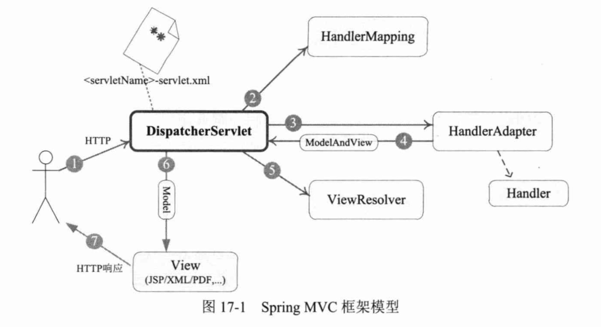
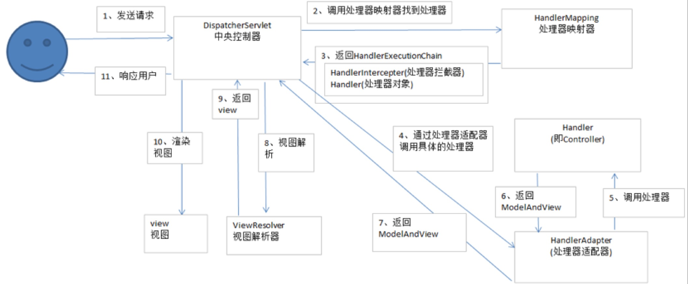
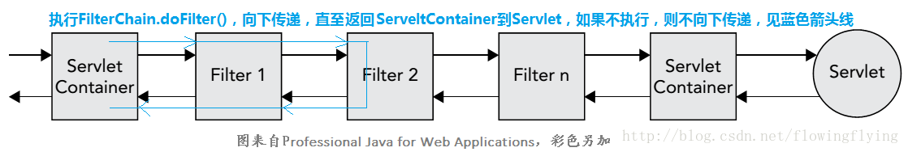

###Spring MVC 体系概述  

  Spring MVC围绕DiapatherServlet这个核心展开,DispatherServlet是Spring MVC的总导演，总策划，它负责截取请求并将其分派给响应的处理器处理，Spring MVC 框架包括注解驱动控制器、请求及响应的信息处理、视图解析、本地化解析、上传文件解析、异常处理及表单标签绑定等内容。

####一：SpringMVC体系结构  

      1：整个福偶成始于客户端发送一个http请求，web应用服务器接收到这个请求。如果匹配Diapather
    Servlet的请求映射路径（在web.xml中指定）,则web同期将该请求转交给DiapatherServlet处理。  
    
      2：DiapatherServlet接收到这个请求后，将根据请求信息（包括url、http方法、请求报文头、请求
    参数、cookie等）及HandlerMapping的配置找到处理请求的处理器（handler）。可将HandlerMapping  
    看做路由控制器，将handler看做目标主机。值得注意的是在SpringMVC中并没有定义一个Handler接口，  
    实际上任何一个Object都可以成为请求处理器。 
    
      3：当获取Handler后，通过HandlerAdapter对Handler进行封装，再以统一的适配器接口调用Handler。  
    HandlerAdapter是一个是适配器，它用统一的接口对各种Handler方法调用。 
    

      
        4：处理完成业务逻辑后，返回一个ModelAndView给DiapatherServlet，modelAndView包含了试图
      逻辑名和模型数据信息。 
        5：ModelAndView中包含的"逻辑视图名"并非真正的视图对象，ModelAndView借助ViewResolver  
      （视图解析器）完成逻辑视图名到真正视图之间的解析动作。  
        6：当得到真正的视图后，DiapatherServlet就使用这个View对象对ModelAndView中的数据模型进  
      行视图渲染。  
        7：最终用户得到一个http页面，或xml、json、又或者是一张图片、pdf文档等。
   

***要了解 SpringMVC 框架的工作机理， 必须回答以下 3 个问题。***  

(1) DispatcherServlet 框架如何截获特定的 HTTP 请求并交由 Spring MVC 框架处理？  
(2) 位于 Web 层的 Spring容器(WebApplicationContext)如何与位于业务层的 Spring容器(ApplicationContext)建立关联， 以使Web层的Bean可以调用业务层的Bean?  
(3) 如何初始化SpringMVC的各个组件，并将它们装配到 DispatcherServlet中？

####二：配置DiapatherServlet  （本节web.xml中说明） 

*  我们可以在web.xml中配置一个Servlet, 并通过<servlet-mapping>指定其处理的URL。这是传统的DispatcherServlet 配置方式。  
*  而Spring4.0已全面支持Servlet3.0, 因此也可以采用编程式的配置方式。

#####一个简单的实例
    Spring应用开发一般包括以下几个步骤：  
      (1)配置web.xml. 指定业务层对应的Spring配置文件， 定义DispatcherServlet。  
      (2)编写处理请求的控制器（处理器）。
      (3)编写视图对象，这里使用JSP作为视图。  
      (4)配置SpringMVC的配置文件，使控制器、视图解析器等生效。
      
#####Spring中过滤器Filter用途  

Filter可以用于以下方面：  

    1：记录request和response的log  
    2：进行认证和授权  
    3：进行压缩和加压，非HTTPS的加密和解密  
    4：错误处理。对于tomcat，出现错误通常会给出一个500的页面，还有错误诊断信息，对于一个公众服务，这些诊断信息可能会向黑客  
    泄漏一些敏感信息，通过Filter，我们可以用try{}catch(){}，将这些诊断信息记录在log中，而向公众展现一个通用的错误页面。  
    
      
    Filter可以在Servlet执行前以及执行后进行相应的动作，而不仅仅在执行前。
  
  Filter的定义方式有三种方式：  
      
      1：web.xml中配置filter（例：web.xml）
      2：@WebFilter注解，实现Filter接口（例：SessionValidateFilterAnnotation）
      3：在代码汇总定义（例：SpringMVCApplicationinitializer）
  
  Filter的顺序  
  
    前面我们了解如何通过web.xml和代码设定filter的优先顺序。filter可以通过url或者servlet名字进行匹配。在实际的匹配中，  
    先执行满足url匹配的filter，如果有多个，则按filter的优先顺序，接着执行满足servlet名字匹配的filter，如果有多个，则  
    按filter的优先顺序。例：FilterA优先于filterB，对于某个http请求，filterA是serveltName匹配，filterB是url匹配，  
    则先执行filterB。
  
####三：注解驱动的控制器  

#####1：@RequestMapping映射请求  

将请求映射到控制器处理方法的工作包含一系列的映射规则，这些规则是根据请求中的4个方面的信息进行制定：请求URL、请求参数、请求方法、请求头。
    
    @RequestMapping中的参数可全部包含，如：
    @RequestMapping()
    
  @RequestMapping 不但支持标准的URL, 还支持Ant风格（？、 ＊ 和 ＊＊字符， 参见 4.3.2节）的和带{xxx}占位符的URL。 以下URL都是合法的。
  
    D /user/*/createUser: 匹配/user/aaa/create User、/user/bbb/createUser等URL。 
    D /user/**/createUser: 匹配/user/createUser、/user/aaa/bbb/createUser等URL。 
    D /user/createUser??: 匹配/user/createUseraa、/user/createUserbb等URL。
    D /user/ { userld} : 匹配 user/123、 user/456等URL。
    D /user/**/{userld}: 匹配 user/aaa/bbb/123、 user/aaa/456等URL。
    D company/{companyId}/user/{userId}/detail： 匹配company/123/user/456/detail等URL。
  
  **请查看RequestMappingController。**
  
#####2：几种典型的处理方法签名 

@RequestParam、@RequestHeader、@CookieValue、@RequestBody、@ResponseBody中的参数详解  
    
  **请查看RequestMappingController第57行。**
  
#####3：使用矩阵变量绑定参数
    
     @MatrixVariable 注解  
     
     一种我以前没见过的新的注解方式，在Spring3.2第一次出现，在Spring4中得到完善，算是吸引人的新特性。
     
   **请查看MatrixVariableController第57行。**
   
#####4：模型数据的处理  
      
      模型数据类型：
      ModelAndView:处理方法返回值类型为ModelAndView时，方法体即可通过该对象添加模型数据。
      @ModelAttribute:在方法入参标注该注解后，入参的对象就会放到数据模型中。
      Map和Model:如果方法入参为org.springframework.ui.Model、org.springframework.  
                 ui.ModelMap或java.util.Map, 则当处理方法返回时， Map中的数据会自动  
                 添加到模型中。
      @SessionAttributes:将模型中的某个属性暂存到 HttpSession中， 以便多个请求之间可以共享这个属性。
      
   **请查看ModelDataController。**