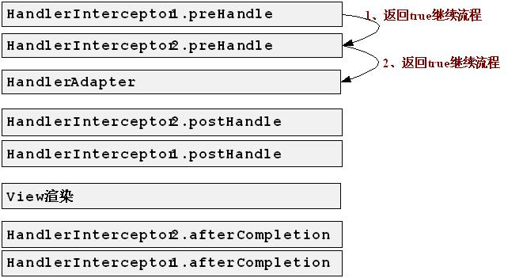
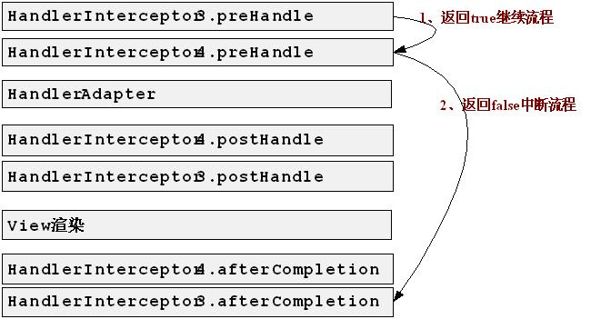
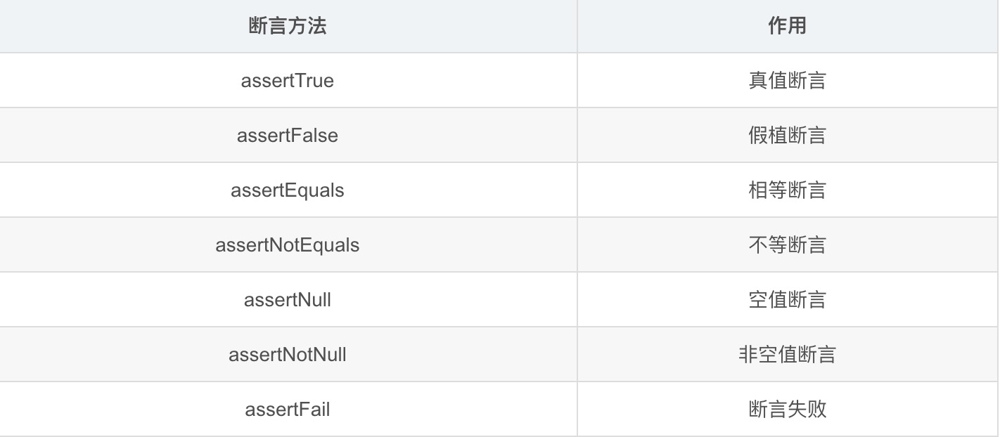

#实战单元测试

##Log4g2的实战应用
    
    第一步：引入Log4g2的包，在springtest的pom.xml中可以找到
    第二步：在rescources中创建log4j2.xml配置文件，log4j2不再支持.properties配置
    第三步：了解log4j2配置文件中的内容说明，制作自己满意的配置文件
    第四步：将配置文件引入到容器中，在web.xml配置日志文件
   
##Spring-Mybatis的整合

    第一步：引入Spring-Mybatis整合的包，在springtest的pom.xml中可以找到
    第二步：将所有的xml写入pom.xml中
    请看pom.xml的配置文件 
    
##Spring拦截器

**请看interceptor包**
    
    拦截器详解：http://jinnianshilongnian.iteye.com/blog/1670856/

运行流程图

正常流程

##SpringTest

###单元测试工具：Junit4

    JUnit4通过注解的方式来识别测试方法。目前支持的主要注解有：
    
    @BeforeClass 全局只会执行一次，而且是第一个运行
    @Before 在测试方法运行之前运行
    @Test 测试方法
    @After 在测试方法运行之后允许
    @AfterClass 全局只会执行一次，而且是最后一个运行
    @Ignore 忽略此方法：例：@Ignore("Test is ignored as a demonstration")
    
    断言：
    使用Matchers提供更多类型的断言。
      
    Junit4提供的基本断言：
    例子：
        assertTrue(responseString.contains("color") || responseString.contains("colour"));

    
    
    测试类型：
    1：测试异常：JAVA中的异常处理也是一个重点，因此你经常会编写一些需要抛出异常的函数。那么，如果你觉得一个函数应该抛出异常，但是它没抛出，这算不算Bug呢？这当然是Bug，并JUnit也考虑到了这一点，来帮助我们找到这种Bug。例如，我们写的计算器类有除法功能，如果除数是一个0，那么必然要抛出“除0异常”。因此，我们很有必要对这些进行测试。代码如下：
    @Test(expected = ArithmeticException.class)
    public void divideByZero(){
          calculator.divide(0);
    }
    如上述代码所示，我们需要使用@Test标注的expected属性，将我们要检验的异常传递给他，这样JUnit框架就能自动帮我们检测是否抛出了我们指定的异常。
    
    2：测试超时：
    @Test(timeout=1000)
    
    要为某个测试类中的所有方法设定超时，需要在测试类中添加一个org.junit.rules.Timeout的字段并用@Rule注解。 
    @Rule
    public Timeout globalTimeout = Timeout.seconds(10); // 10 seconds max per method tested
       
    3. controller测试 ：MockMvc测试SpringMVC
    4. service测试
    5. dao测试